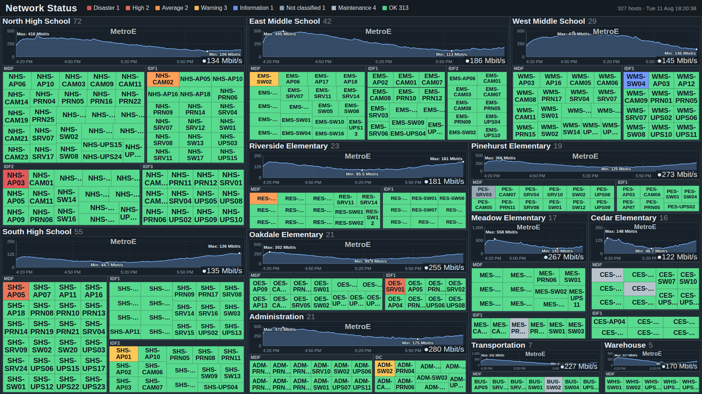

# noc-treemap

A single-file PHP page that renders a whole Zabbix estate as a live treemap for a
NOC wall display.

Every site gets a packed block sized by how many hosts it has, every wiring closet
gets a sub-block inside it, and every host is a tile colored by its worst active
problem. Uplink sparklines are drawn per site from item history. The page
refreshes itself, so you point a TV at it and walk away.



*A synthetic 12-site, 327-host estate rendered at 1920x1080 with the stock config.*

There is no database, no build step, and no framework — one script, one config
file, and a read-only Zabbix API token.

## Try it without Zabbix

To see the page before wiring up an API token, generate one from synthetic data:

```bash
php tools/make-demo.php          # writes docs/demo.html
```

Open that file in a browser. It uses the real rendering code — same layout maths,
colors, and font fitting as a live install — so it is also the quickest way to
preview a config change:

```bash
NOC_DEMO_CONFIG=/etc/zabbix/noc-treemap.conf.php php tools/make-demo.php
```

No network calls are made and the API token is never read.

## Requirements

- PHP 8.0+ with the `curl` and `json` extensions
- Zabbix 5.0+ (uses the JSON-RPC API and bearer-token auth; on Zabbix 5.x you may
  need to adapt authentication to the older `user.login` scheme)
- A web server that can serve PHP (nginx + php-fpm, or Apache)

## Install

```bash
# 1. Put the script where your web server can serve it
sudo install -m 0644 noc-treemap.php /usr/share/zabbix/noc-treemap.php

# 2. Put the config OUTSIDE the web root
sudo install -d /etc/zabbix
sudo install -m 0640 -o root -g www-data \
    noc-treemap.conf.example.php /etc/zabbix/noc-treemap.conf.php

# 3. Create the cache directory, writable by the PHP process
sudo install -d -m 0750 -o www-data -g www-data /var/cache/zabbix-noc
```

Adjust the owner/group to whatever user your php-fpm pool runs as.

Then edit `/etc/zabbix/noc-treemap.conf.php` and set at minimum:

- `api_url` — your Zabbix `api_jsonrpc.php` endpoint
- `api_token` — see below
- `group_pattern` — how to split your host group names into site and closet

### The API token

Create a **read-only** role and user in Zabbix, then generate an API token for it
(*Users → API tokens*). The page never writes anything through the API, so the
token should have no write permissions at all.

Keep the config file at mode `0640` and out of the web root. If you must keep it
next to the script, make sure your web server cannot serve `.conf.php` directly.

## Host group naming

The treemap's structure comes entirely from your Zabbix host group names. The
default pattern expects `Site/Closet`:

```
NHS/MDF
NHS/IDF2
Warehouse/MDF
```

`group_pattern` is a regex with named captures `site` and (optionally) `sub`. If
your naming is different, change the pattern rather than renaming groups.
`exclude_pattern` drops the built-in Zabbix groups; `aliases` folds inconsistent
labels together; `only` limits rendering to a subset while you are testing.

## Uplink sparklines

Uplink graphs are **pinned**, not auto-detected at render time — the web process
needs no write access anywhere, and a graph you chose never changes on its own.

Seed the pin file once:

```bash
php noc-treemap.php --seed          # detect and write, skipping sites already pinned
php noc-treemap.php --seed --force  # re-detect everything
php noc-treemap.php --seed --site NHS
php noc-treemap.php --list          # show what is currently pinned
```

Seeding scans each site's uplink closet (`seed_closet`) for interface bit-rate
items, prefers ports whose description matches `seed_prefer`, and falls back to
ranking by recent traffic. The result lands in `uplinks_file` as plain JSON that
you can hand-edit — the page only ever reads it.

Graphs render in one of two styles, set by `graph_style`:

- `chart` — axes, gridlines, time labels, and annotated min/max
- `spark` — a bare area-and-line, for bands too short to letter

`chart` falls back to `spark` on its own when a band is shorter than
`graph_axes_min_h` pixels, so small sites stay readable without extra config.

## Display names

Optional. `labels_file` lets you rename sites, closets, and hosts for the wall
display without touching Zabbix. Anything not listed keeps its real name, and
hover text always shows the real name.

```bash
php noc-treemap.php --labels-template > /etc/zabbix/noc-labels.json
```

## Checking it works

```bash
php noc-treemap.php --selftest
```

This validates the config, calls the API, checks the cache directory is writable,
and reports how many uplinks are pinned.

## Tuning the layout

Everything below `--- presentation ---` in the config is cosmetic. The ones worth
knowing:

| Key | What it does |
| --- | --- |
| `exponent` | Site area weighting. `1.0` is strict host count; lower values give small sites more room. |
| `graph_h` | Graph band height as a % of page. `0` disables graphs entirely. |
| `graph_fill_gaps` | Buckets to carry the last value across before a gap counts as a real outage. Prevents a summed total from sawtoothing when in/out samples land in different buckets. |
| `hide_label_below` | Tiles smaller than this (% of page) render unlabeled. |
| `font_uniform` | `closet` sizes all tiles in a closet alike; `tile` sizes each independently. |
| `cache_ttl` | Seconds. Keeps a wall of screens from hammering the API. |
| `refresh` | Browser meta-refresh interval. |

`fit_width` / `fit_height` are the reference resolution used for the font-fitting
math — set them to your actual display if it is not 1920×1080.

**If host names are getting ellipsized:** with `font_uniform => 'closet'`, every
tile in a closet shares one font size, chosen so that `font_percentile` of the
names fit — the longer ones then truncate. Lower `font_percentile`, switch to
`font_uniform => 'tile'` to size each tile independently, or shorten what is
displayed with `strip` / `labels`. Hover text always shows the full name.

## Notes

- Every page load hits the Zabbix API. Leave `cache_ttl` at a non-zero value if
  more than one screen points at this.
- `verify_tls` defaults to on. If Zabbix uses an internal CA, set `ca_bundle` to
  the PEM path rather than disabling verification.
- Maintenance-window handling is controlled by `maintenance_severity`.
